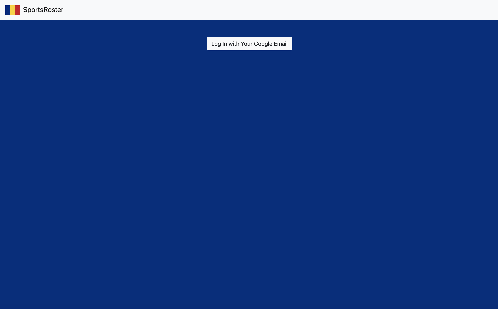
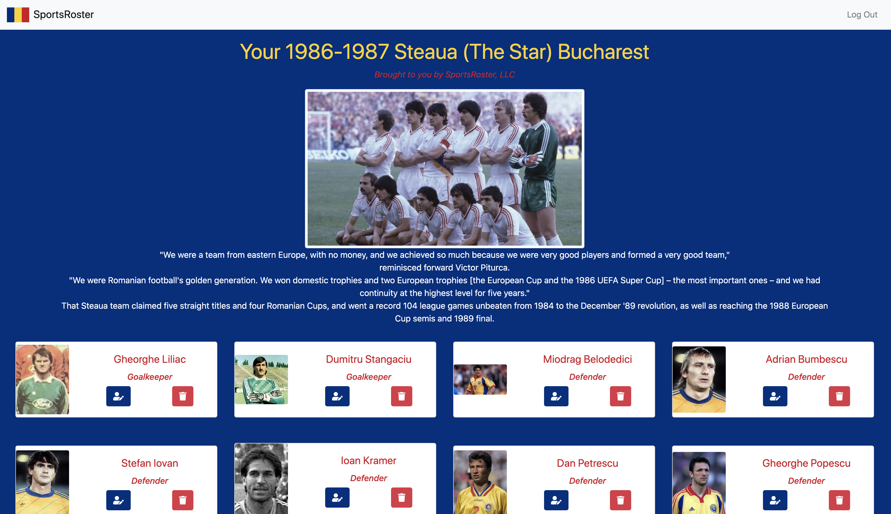
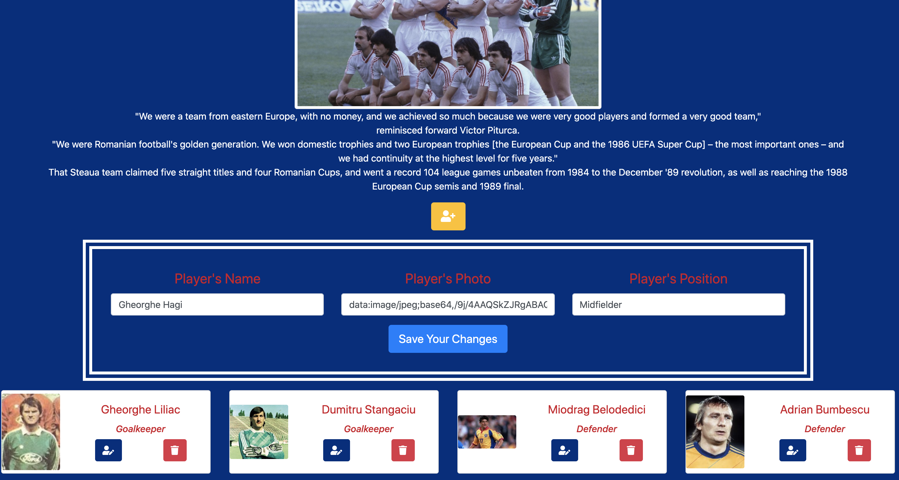

# Sports Roster
[SportsRoster](https://sportsroster-76450.web.app)

## Description
This project is an exploration into coding CRUD functions (create, read, update, delete) in a React project, while using a Firebase database for user authentication and data management. Project instructions can be found [here](https://github.com/nss-nightclass-projects/exercise-vault/blob/master/REACT_sports_roster.md).

## Background
Steaua of the later '80s and early '90s is the amazing soccer team I grew up with. These names - Hagi, Belodedici, Piturca, Lacatus, etc. - are engraved deeply in my childhood recollections. As I read them, my memory instantly overlays a TV announcer's voice with a step-by-step analysis of their play in a given match. And images of my father intently watching and discussing the plays afterwards. And sounds of "Goooooal" pouring out of hundreds of balconies with open windows, uncoordinated yet simultaneous, as soon as one of these players made history. 

## Screenshots
##### Login Page

##### Home Page

##### Editing a Player's Details

## Features
1. Users are authenticated via Google login. 
1. Users can view a list of all the players and their names, position on the field, and photos.  
1. Users can edit a player's details. 
1. Users can delete players. 

## Technologies & Tools
Axios, Bootstrap, CSS, ES6 Modules, ESLint, Firebase (for authentication and data management), Github (for version control), Google login authentication, HTML5, JavaScript, React, Webpack

## How to Run
1. Clone down this repo.
1. Create apiKeys.json file using the template apiKeysExample.json with your own firebase keys added.
1. Make sure you have http-server installed via npm. If not, get it [here](https://www.npmjs.com/package/http-server).
1. On your command line, run `hs -p 9999`.
1. In your browser, navigate to `http://localhost:9999`.

## Firebase Deployment
Thsi project has been deployed with Firebase. You can find it here: https://sportsroster-76450.web.app.

